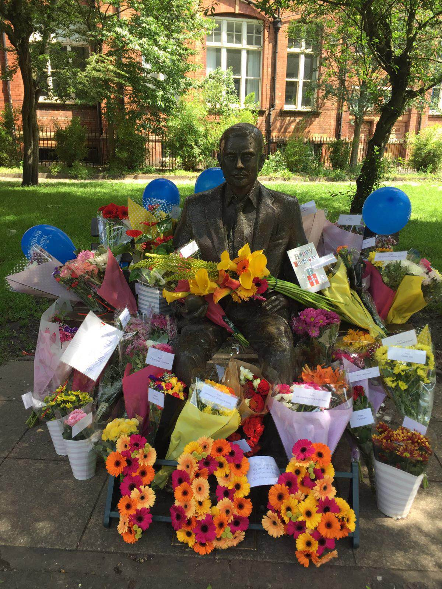

Alan Turing, the pioneering Computer Scientist and World War II codebreaker, has a statue in Sackville Gardens in Manchester. On 23rd June each year, we surround it with flowers in his memory for his birthday.

This started in 2013, like many things, as a small gesture, and since then has grown to be a modest charity event raising over £5600 for the amazing charity Special Effect!

We’re doing it again for 2019!

On 23rd June 2019, we’re going to lay birthday  flowers at Alan Turing’s statue (and obviously, clean them up again after).  Anyone who wants to get involved is welcome. Donations are made up of £3.50 to cover the cost of the flowers and a £13 charity contribution to Special Effect for a total of £16.50.

Please use our Paypal Pool to donate!

If you’d like to know where the money goes – here’s a [handy video](https://www.youtube.com/watch?v=kpYNG7MivHs&feature=emb_title) from Special Effect.
